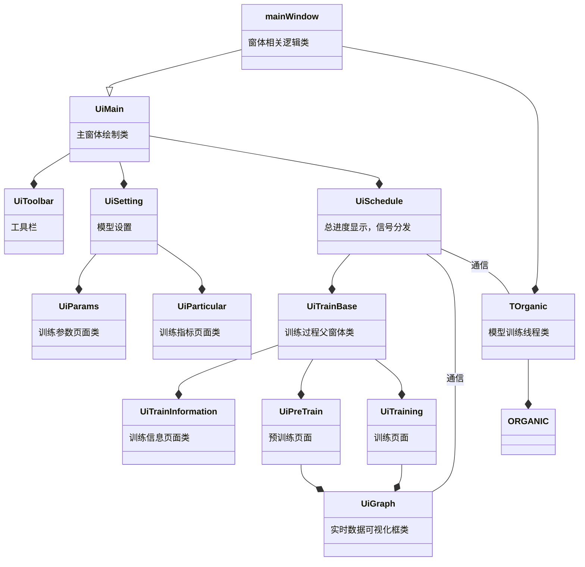

# 设计说明

[TOC]


## 功能

1. 模型训练参数设置
   + 参数格式检查（类型，范围）
   + 参数导出，导入(*.json格式)
2. 训练过程可视化展示
3. 训练结果保存


##  模型训练参数设置

1. 训练参数页面，训练指标页面内容根据`./Ui_Window/stdSetting.json`文件加载
2. `stdSetting.json`文件相关说明

```js
{
    "name":{							#对应参数 name
        "name":"模型名称",   				#展示给用户的名称，若名称为空则加载参数名
        "help":"",							#为用户书写的帮助，该参数的用途，规范等
        "type":"str",						#该参数的类型，此为字符串
        "value":"metrics"},					#该参数的值 字符串文件路径加括号，空则写 null
    "params":{							#对应参数 params 该参数为字典
        "PRETRAIN_GEN_EPOCHS":{				#子参数名
            "name":"生成器预训练批次数",
            "help":"",
            "type":"int",				#该类型为整数
            "value":240},
        "DIS_FILTER_SIZES":{
            "name":"判别器池化层过滤器大小",
            "help":"",
            "type":"list-int",			#该类行为整数列表
            "value":[5,10,15]},
        "DIS_L2REG":{
            "name":"l2范数损失系数",
            "help":"",
            "type":"float",				#该类行为小数/浮点数
            "check":"0\\.[0-9]*[1-9]|1", #用于检查参数值的正则表达式 此处筛选范围（0, 1]
            "value":0.2},
                
                ………………							
                #此处省略可自行添加，页面会自动改变，不得空行
                #此处类添加参数
                #必写    "name" 同上
                #    	"help" 同上
                #		"type" 同上，共五种整数"int" 小数"float" 可为空整数"int null"
                #							整数列表"list-int" 路径"path"
                #		"value" 
                #选写 "check" 可使用正则表达式精确限制
        
        
        "CHK_PATH":{
            "name":"模型保存路径",
            "help":"",
            "type":"path",				#该类行为路径/文件/文件夹
            "value":"./ORGANIC/model/checkpoints/"}},
    "data_set":{					#对应参数 data_set
        "name":"训练数据集",
        "help":"",
        "type":"path",
        "value":"./ORGANIC/data/trainingsets/Value_Ki.smi"},
    "metrics":{						#此处子参数为可选指标
        "validity":{
            "name":"",
            "help":"",
            "recommend": 0,				#该指标是否推荐使用 推荐为 1 不推荐为 0
            "value":null},				#该参数建议step
         
         		………………							
                #此处省略可自行添加，页面会自动改变，不得空行，默认为整数
                #此处类添加参数
                #必写    "name" "help" "value" "recommend"
                #选写 "check" 可使用正则表达式精确限制
                
        "logP":{
            "name":"",
            "help":"",
            "recommend": 1,
            "value":5}
}
```

3.  参数使用前会自动检查类型，
    + 如有`"check"`则优先检查`"check"`，再检查类型
    + 参数检查前会自动去除前后空字符
4.  用户可自行加载和保存参数于`./setting/*.json`文件，==仅包含参数与参数值，不建议自行修改==，样例如下：

```json
{
    "name": "metrics",
    "params": {
        "TRAIN_LOOP": 10,
        "PRETRAIN_GEN_EPOCHS": 240,
        "PRETRAIN_DIS_EPOCHS": 50,
        "GEN_ITERATIONS": 2,
        "GEN_BATCH_SIZE": 64,
        "SEED": null,
        "DIS_BATCH_SIZE": 64,
        "DIS_EPOCHS": 3,
        "EPOCH_SAVES": 20,
        "GEN_EMB_DIM": 32,
        "GEN_HIDDEN_DIM": 32,
        "SAMPLE_NUM": 6400,
        "BIG_SAMPLE_NUM": null,
        "LAMBDA": 0.5,
        "MAX_LENGTH": null,
        "DIS_EMB_DIM": 64,
        "DIS_FILTER_SIZES": [
            5,
            10,
            15
        ],
        "DIS_NUM_FILTERS": [
            100,
            100,
            100
        ],
        "DIS_DROPOUT": 0.75,
        "DIS_L2REG": 0.2,
        "START_TOKEN": 0,
        "CHK_PATH": "./ORGANIC/model/checkpoints/"
    },
    "data_set": "./ORGANIC/data/trainingsets/Value_Ki.smi",
    "metrics": {
        "metrics": [
            "lipinski",
            "logP"
        ],
        "steps": [
            5,
            5
        ]
    }
}
```


## 类关系视图



